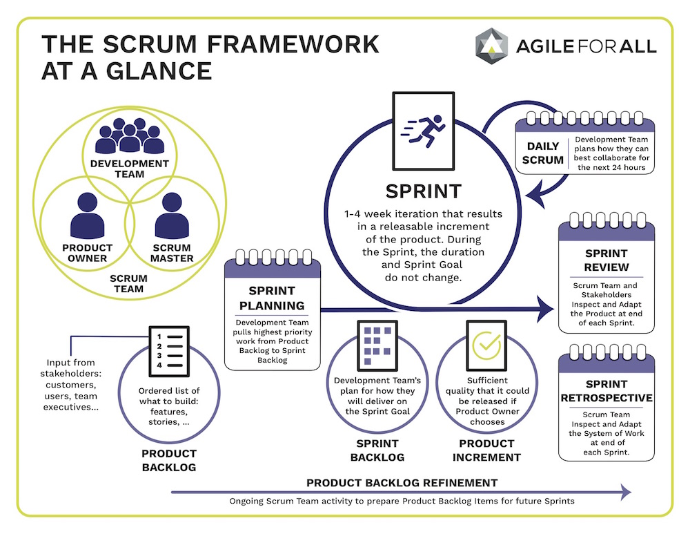

# SCRUM Basics
Scrum is a framework based on Agile. It promotes self-organizing, self-motivating teams that deliver small, fully functional pieces of a deliverable in iterations called *sprints*. Sprints can be one to four weeks long, with two or three weeks being the industry standard.

## SCRUM Values
*Source: [Scrum Alliance](http://www.ScrumAlliance.org)*

>For an individual, team, or organization to realize the benefits of Scrum, the structural components of
the framework are an important, but incomplete, factor. The components of the framework are the
visible, logical system of Scrum. Since Scrum is meant to be used by people who have complex,
varied beliefs and values that influence their behavior, it is important to describe the values that make
the system work in practice. The components of the framework are like the brain of Scrum. The five
Scrum values: *commitment*, *courage*, *focus*, *openness*, and *respect*, are like the heart of Scrum.

-	**Commitment** literally means “joined together.” It involves sharing our sincere intent to act, and then accepting responsibility for following through on that intended action. In Scrum, people personally commit to achieving the shared goals of the Scrum Team.

-	**Courage** means “from the heart.” It involves acting in alignment with our beliefs, especially when that is hard. Scrum Team members have courage to do the right thing and work on tough problems.

-	**Focus** comes from the Latin word for “domestic hearth,” which was the location of the fire at the center of the home. People in the home gathered around the hearth for warmth, light, and sustenance, since it was used for cooking. The focus was literally the thing that brought people together. In Scrum, everyone focuses on the work of the Sprint and the goals of the Scrum Team.

-	**Openness** means “exposed or evident.” The Scrum Team and its stakeholders agree to be open about all the work and the challenges with performing the work. Openness is closely related to the empirical pillar of Transparency.

-	**Respect** means “to look or view again.” Respect involves taking a second look at how we view others, to develop a sincere appreciation for the unique capabilities that they contribute. Scrum Team members respect each other to be capable, independent people.

## SCRUM Team Roles
Scrum works best when a team is focused on delivering a single product or suite of related products. The Scrum Team is composed of:
-	Three to nine developers with the collective skills to design, build, and test any deliverables related to the product.

-	A *Product Owner* who acts as the voice of the customer and is responsible for building and managing the work, called the *backlog*.

-	A *Scrum Master* who facilitates meetings, protects the team from external distractions, removes impediments, and is looked to as the expert in Agile and Scrum practices.

## SCRUM Events
Each sprint incorporates regular, timeboxed meetings called *ceremonies* or *events*. These include:
-	**Daily Scrum**
*Required Attendees: Development Team
Optional Attendees: Scrum Master, Product Owner
Timebox: 15 minutes*
A stand-up meeting where each member of the team provides a quick status update, often in the following format: “I did x yesterday, I’m doing y today, and I have n impediments to my work”. 

-	**Sprint Planning**
*Required Attendees: Scrum Team
Timebox: 1 hr/week of sprint*
A meeting where work for the sprint, called user stories, is identified and organized by priority. The team then identifies which of the development team members will own and work on those stories that are assigned to the sprint. 

-	**Backlog Grooming/Refinement**
*Required Attendees: Scrum Team
Optional Attendees: Stakeholders
Timebox: Varies*
A meeting where the Product Owner explains the who, what, and why of the user stories, and the team identifies the how. The team also identifies and assigns the effort behind the work by assigning a value to the user story called story points.

-	**Sprint Review**
*Required Attendees: Scrum Team, Stakeholders
Timebox: 30-60 minutes*
A demonstration of the completed sprint work that is provided to the customer/stakeholder for feedback and approval. 

-	**Sprint Retrospective**
*Required Attendees: Scrum Master, Development Team
Optional Attendees: Product Owner
Timebox: 30 minutes*
A post-mortem discussion of the Sprint, focusing on what went well and what could be done better, and opportunities for team improvement and experimentation are identified.

## Backlogs and User Stories
-	**Product Backlog**
The full backlog of work related to a product. 

-	**Sprint Backlog** 
The backlog of work committed to in a sprint.

-	**User Story**
An increment of work that can be assigned to one member of the development team that can be completed within the constraints of the sprint. User stories originated with the Xtreme Programming (XP) framework, but are often used to organize work items when practicing Scrum. User Stories are written based on the concept of the 3Cs (Card, Conversation, Confirmation) and identify the Who, What, and Why of the work item. *(Source: Essential XP(https://ronjeffries.com/xprog/articles/expcardconversationconfirmation/))*

